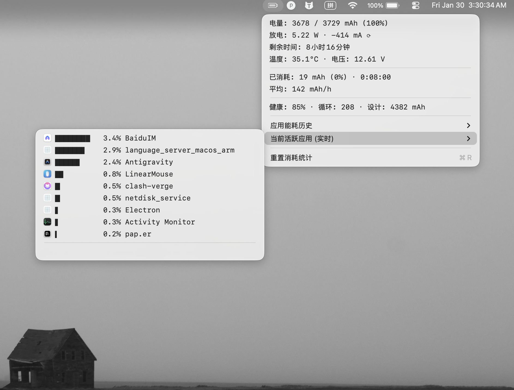

# Battery Monitor (Static)

> Minimalist aesthetics, silent guardian. An **ultra-low power battery & app monitoring tool** for macOS.


[](LICENSE)
[]()
[]()

[中文](README.md) | [English](README_EN.md)

---

## 📖 Overview

**Battery Monitor** (Static) is a lightweight battery management tool designed specifically for macOS. Rejecting the cluttered interfaces of traditional monitoring software, it adopts a minimalist design language aimed at providing the most accurate and practical battery health and energy consumption data with minimal system resource usage.

Whether for daily office work or mobile development, it helps you grasp your Mac's power status in real-time, accurately locate "energy-draining" apps, and extend battery life.

## ✨ Core Features

### 1. Deep Battery Monitoring
- **Real-time Data**: Accurately displays current capacity, charge/discharge power (W), amperage (mA), voltage (V), and battery temperature.
- **Visualized Curve**: View the **last 48 hours** of battery trend with a **smooth Bezier curve**, making power drops and charging phases (highlighted in green) instantly recognizable.
- **Health Management**: Visually presents battery health, cycle count, and design capacity comparison.
- **Time Estimates**: Real-time calculation of remaining usage time or time to full charge based on current power consumption.

### 2. Precise App Energy Analysis
- **Live Ranking**: Instantly refreshes the list of apps with the highest CPU usage, helping you spot high-energy processes immediately.
- **36-Hour History**: Automatically records app energy consumption data for the past **36 hours**.
- **Energy Contribution %**: Instead of raw CPU usage, we calculate the **Energy Contribution Percentage (0-100%)**. This accurately reflects how much a specific app contributes to total system power draw at any given moment.
- **Smart Gap Detection**: Automatically detects sleep or idle periods, represented by distinct indicators in the charts.



### 3. Persistent Data Tracking
- **Auto-Save**: Historical energy data is automatically restored after app exit or restart; records are never lost.
- **Periodic Backup**: Automatically backs up data every 5 minutes in the background to prevent accidental loss.

### 4. Extreme Performance & Experience
- **Silent Operation**: Average CPU usage **< 0.1%** and memory usage **< 20MB** when running in the background.
- **Smart Refresh**: Refreshes every second when the menu is open, and automatically enters ultra-low power mode (60s/interval) when closed.
- **Multi-language Support**: Native support for Simplified Chinese and English, with options to follow system settings or switch manually.

## 🛠 Technical Architecture

This project is developed entirely in native **Swift 5.9**, without reliance on any large third-party libraries, ensuring the app remains lightweight and efficient.

- **User Interface**: Native macOS menu bar interface built on **AppKit**.
- **Battery Core**: Communicates directly with hardware using the low-level **IOKit** framework to fetch the most accurate sensor data.
- **Process Monitoring**: Retrieves process information via system-level BSD commands (`sysctl`/`ps`) and filters system daemons using intelligent algorithms.
- **Data Persistence**: Uses the `Codable` protocol combined with JSON serialization for lightweight file storage.

## 📥 Installation

### Method 1: Download App (Recommended)
1. Visit the [Releases](https://github.com/dxylxy/BatteryMonitor-JingDian/releases) page.
2. Download the latest `Battery Monitor.dmg` (or `静•电.dmg`).
3. Double-click the DMG file and drag `Battery Monitor` into the `Applications` folder.
4. Launch the app.

### Method 2: Build from Source
If you are a developer or wish to compile it yourself:

```bash
# 1. Clone the repository
git clone https://github.com/dxylxy/BatteryMonitor-JingDian.git
cd BatteryMonitor-JingDian

# 2. Run the packaging script
./package.sh

# 3. Install
# After building, find the generated DMG package in the dist/ directory
open dist/
```

## 🖥 Usage Guide

1. **Launch**: The app lives in the top menu bar, displaying a battery icon and percentage.
2. **View Details**: Click the menu bar icon to expand the detailed information panel.
3. **Switch Views**:
   - **App Energy History**: View per-app energy contribution curves for the past 36 hours.
   - **Active Apps**: View apps currently running and consuming CPU.
4. **More Settings**:
   - **Right-click** the menu bar icon to access the settings menu.
   - Configure **Language**, **Launch at Login**, or **Export Energy Report** (CSV/JSON).

## ⚠️ Known Issues & Limitations

- **System Process Permissions**: Detailed energy data for some system-level processes (like `kernel_task`) may be restricted due to macOS sandboxing mechanisms.
- **Refresh Rate**: To ensure low power consumption, the background refresh rate is limited to once per minute, meaning historical data granularity is minute-level.

## ☕️ Support

If you find this app helpful, please consider supporting its development!

<div align="center">
  
  
</div>


## 🤝 Contribution

We welcome community contributions! If you have ideas for reporting bugs or submitting Pull Requests:

1. Fork the repository.
2. Create your feature branch (`git checkout -b feature/AmazingFeature`).
3. Commit your changes (`git commit -m 'Add some AmazingFeature'`).
4. Push to the branch (`git push origin feature/AmazingFeature`).
5. Open a Pull Request.

## 📄 License

This project is licensed under the MIT License. See the [LICENSE](LICENSE) file for details.

---
Copyright © 2026 Lyon. All rights reserved.
