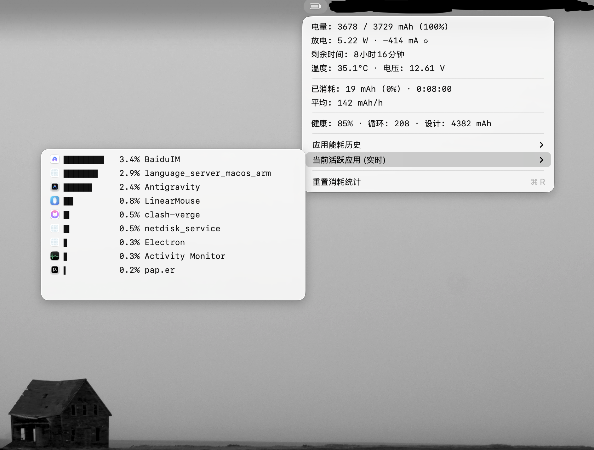

# 静•电 (MacBatteryMonitor - JingDian)
·1  
> 极致简约，静默守护。一款遵循现代审美主义的 macOS **极致低功耗电池与应用能耗分析工具**。

[](LICENSE)
[]()
[]()

[English](README_EN.md) | [中文](README.md)

---

## 📖 应用概述

**静•电** 是一款专为 macOS 打造的轻量级能耗洞察工具。它不做复杂面板、不打扰工作流，只在你最需要的地方给出关键答案：**电池还剩多久、系统在耗什么、谁在偷电**。

它用极低的后台占用换取高密度的信息表达，把“电量曲线 + 应用能耗 + 智能解释”收敛在一张菜单里，适合通勤办公、移动开发与高强度创作场景。

## ✨ 核心亮点

### 1) 电池状态一目了然
- **实时仪表**：电量、功率 (W)、电流 (mA)、电压 (V)、温度即时呈现。
- **48 小时曲线**：平滑贝塞尔曲线 + 充电段高亮，让掉电节奏一眼可读。
- **健康维度**：循环次数、设计容量、健康百分比直观对比。
- **时间预估**：自动估算剩余使用时间或充满时间。

### 2) 应用能耗深入解析
- **实时排行**：秒级刷新当前高 CPU 应用。
- **36 小时历史**：完整记录应用能耗轨迹与能耗贡献。
- **能耗贡献曲线**：不是“CPU 占比”，而是“对总耗电的贡献比例”。
- **休眠/断点识别**：自动标注休眠区间，避免误读。

### 3) 能耗口径自由切换
- **今日累计掉电**：从当天 0 点累计掉电后分摊，适合全天概览。
- **最近掉电区间**：只聚焦最近一次连续掉电区间，更贴近“这波掉电谁负责”。
- **菜单内直观切换**：选项可视化，不退出菜单即可刷新排行。

<p align="center">
  
  
</p>

### 4) 数据永不丢
- **自动保存**：退出或重启后历史数据自动恢复。
- **5 分钟备份**：后台定时备份，安心可靠。
- **报告导出**：CSV / JSON 一键导出，适合分析或对比。

### 5) 极致轻量与体验
- **静默运行**：后台 CPU 平均 < 0.1%，内存 < 20MB。
- **智能刷新**：展开菜单 1s 刷新，关闭后 60s 低功耗模式。
- **多语言**：中英文原生支持，跟随系统或手动切换。

## 🧠 你会喜欢它的理由
- 看懂“电量掉得快”的真正原因
- 不被巨型监控面板打断工作流
- 以最少的信息噪音得到最精确的结论
- 越用越懂自己的电脑能耗节奏

## 🛠 技术架构

全项目使用 **Swift 5.9** 原生构建，不依赖庞大第三方库，追求低占用与高准确度。

- **User Interface**：AppKit 原生菜单栏 UI
- **Battery Core**：IOKit 硬件级传感器读取
- **Process Monitoring**：系统级进程采样 + 智能过滤
- **Data Persistence**：Codable + JSON 轻量存储

## 📥 安装与配置

### 方式一：下载安装包 (推荐)
1. 访问 [Releases](https://github.com/dxylxy/MacBatteryMonitor-JingDian/releases) 页面
2. 下载最新 `静•电.dmg`
3. 拖入 `Applications` 文件夹
4. 启动即可使用

### 方式二：从源码构建
```bash
git clone https://github.com/dxylxy/MacBatteryMonitor-JingDian.git
cd MacBatteryMonitor-JingDian
./package.sh
open dist/
```

## 🖥 使用指南

1. **启动**：菜单栏常驻显示电池图标与百分比  
2. **查看详情**：左键展开详情面板  
3. **切换视图**：应用能耗历史 / 当前活跃应用  
4. **更多设置**：右键菜单可切换语言、设置开机自启、导出报告  

## ⚠️ 已知限制

- 部分系统级进程受限于 macOS 权限，能耗数据可能不完整
- 为保证低功耗，后台刷新频率为 1 分钟一次

## ☕️ 支持与打赏

如果你觉得这个小工具对你有帮助，欢迎请我喝杯咖啡，你的支持是我持续维护的动力。

<div align="center">
  
  
</div>

## 🤝 贡献指南

欢迎社区贡献与建议：
1. Fork 本仓库
2. 创建分支 (`git checkout -b feature/AmazingFeature`)
3. 提交更改 (`git commit -m 'Add some AmazingFeature'`)
4. 推送分支 (`git push origin feature/AmazingFeature`)
5. 发起 Pull Request

## 📄 许可证

本项目基于 MIT 许可证开源，详见 [LICENSE](LICENSE)。

---
Copyright © 2026 Lyon. All rights reserved.
